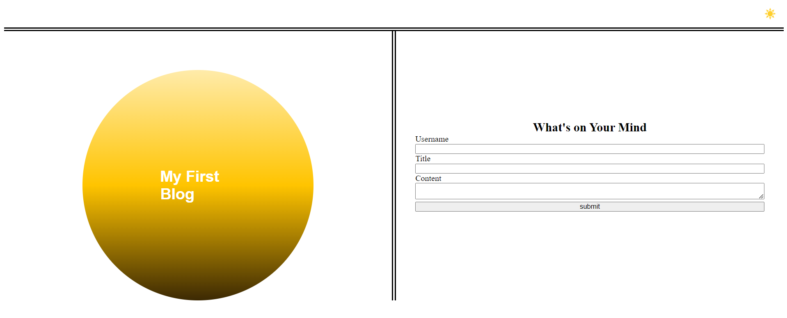

# Web APIs Challenge: Personal Blog

## Description

We were tasked with creating a Blog website that saves the input data in local storage. I was able to:

- Create and design my Blog utilizing CSS.
- Create a night and day design for my webpage that the user can toggle between with the button in the top right hand corner
- Add Javascript functions to save input data to local storage
- Add Javscript functions and a for loop to save and display post that are saved in the local storage. 

## Table of Contents (Optional)

- [Usage](#usage)
- [Credits](#credits)
- [License](#license)

## Usage

<a href="https://github.com/Kadeemking/Module-4-Challenge.git">Git Hub Repo</a>

<a href="https://kadeemking.github.io/Module-4-Challenge/">Live link</a>

## Credits

<a href="https://coding-boot-camp.github.io/full-stack/github/professional-readme-guide">README Format</a> 

## License

## Features

On my Blog you can make a post by just inputting a username, selecting a title for your post, and then inserting your comments or feelings in the content box. Once you're finished you can hit submit, where you will be redirected to the blogs page. There you can see other post listed.
